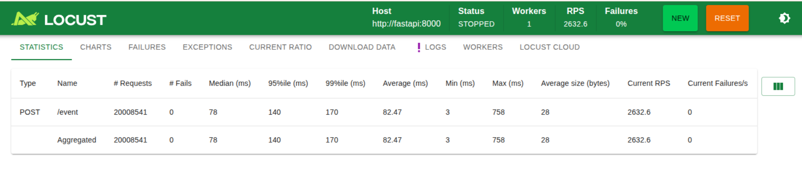
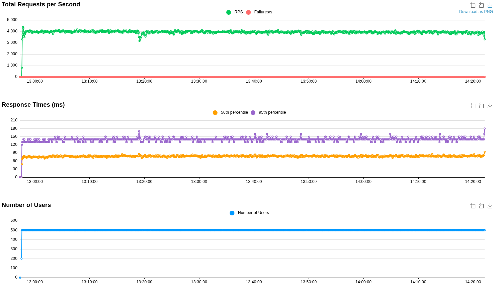
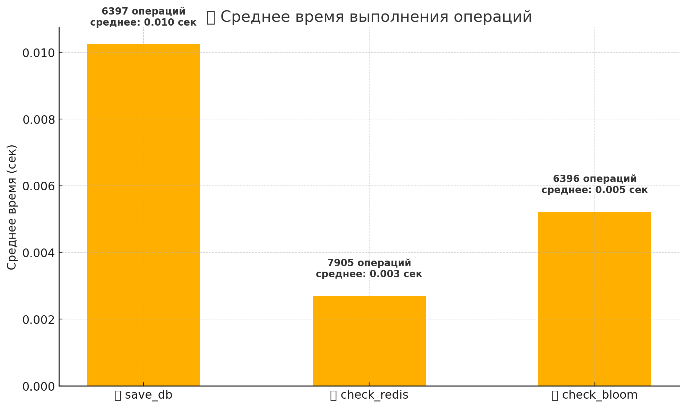

Микросервис на базе FastAPI + Kafka + Redis + PostgreSQL + Bloom Filter для дедупликации продуктовых событий при высоких нагрузках (>1000 RPS).


---

##  Архитектура
- **FastAPI** — прием событий POST /event, отправка в Kafka
- **Kafka** — брокер событий 
- **Consumer** — чтение из Kafka, дедупликация и сохранение
- **Redis** — хранение хешей с TTL
- **Redis Bloom Filter** — для ускоренной проверки на дубли
- **PostgreSQL** — сохранение уникальных событий
- **Prometheus + Grafana** — мониторинг

---


Тест нагрузки (Locust)






___
Итог:  

✅ FastAPI-сервис справился с нагрузкой ~1000 RPS

✅ Нет падений, ошибок или резких провалов по времени ответа

✅ Метрики в Grafana корректно отображаются.

✅ Дедупликация событий через Kafka + Redis работает стабильно

___


💾 save_db:
6397 операций, среднее время — 0.010 сек

⏱️ check_redis:
7905 операций, среднее — 0.003 сек

🔍 check_bloom:
6396 операций, среднее — 0.005 сек

---

## ⚡ Как запустить 

### Запуск сервисов
```bash

git clone https://github.com/suvorova-ya/event_deduplicator.git
cd event_deduplicator


```
### Собрать и запустить сервисы
```bash

docker-compose up --build

```

### Масштабировать количество воркеров (консьюмеров)

```bash

docker compose up -d --scale deduplicator-worker=5

```

- FastAPI API: http://localhost:8000/docs
- Grafana: http://localhost:3000/
- Prometheus: http://localhost:9090/
- Locust : http://localhost:8089/

---


## 💬 Автор
Создано в рамках стажировки.
