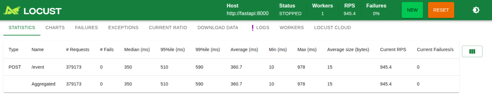
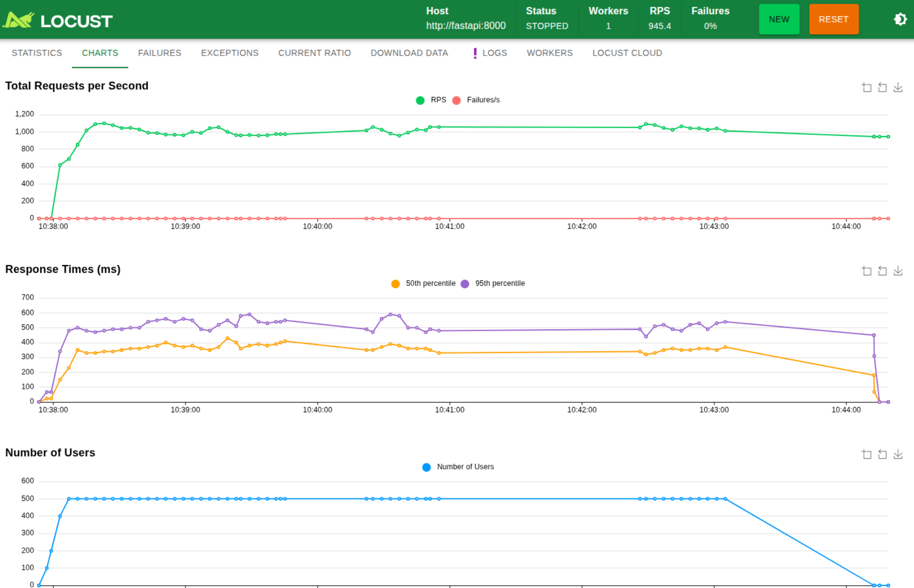
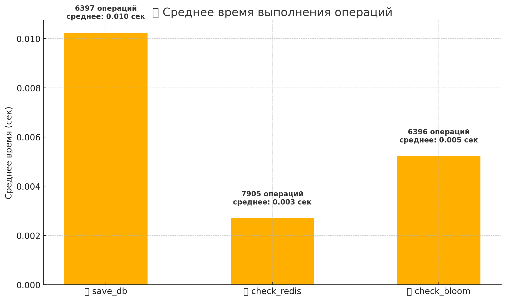

Микросервис на базе FastAPI + Kafka + Redis + PostgreSQL + Bloom Filter для дедупликации продуктовых событий при высоких нагрузках (>1000 RPS).

Тест нагрузки (Locust) при использовании Bloom Filter 

💾 save_db:
6397 операций, среднее время — 0.010 сек

⏱️ check_redis:
7905 операций, среднее — 0.003 сек

🔍 check_bloom:
6396 операций, среднее — 0.005 сек

